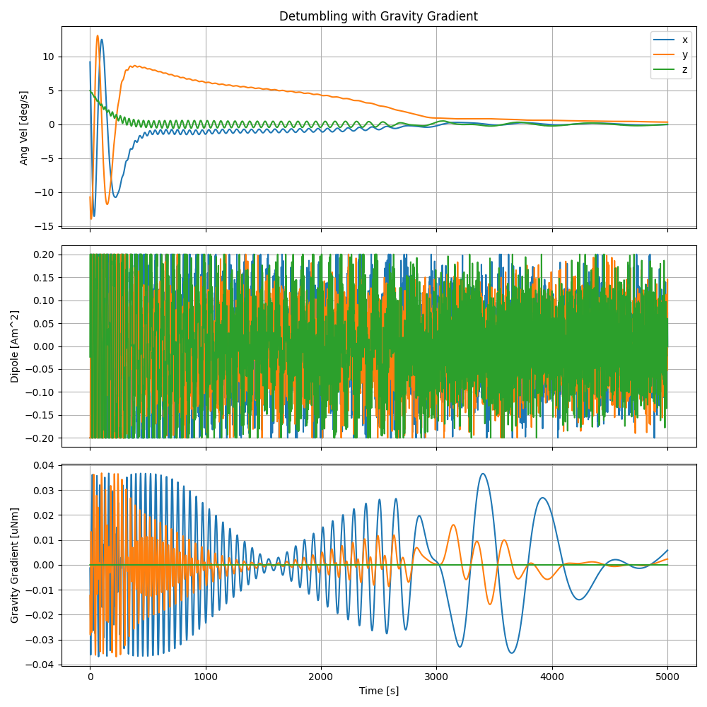
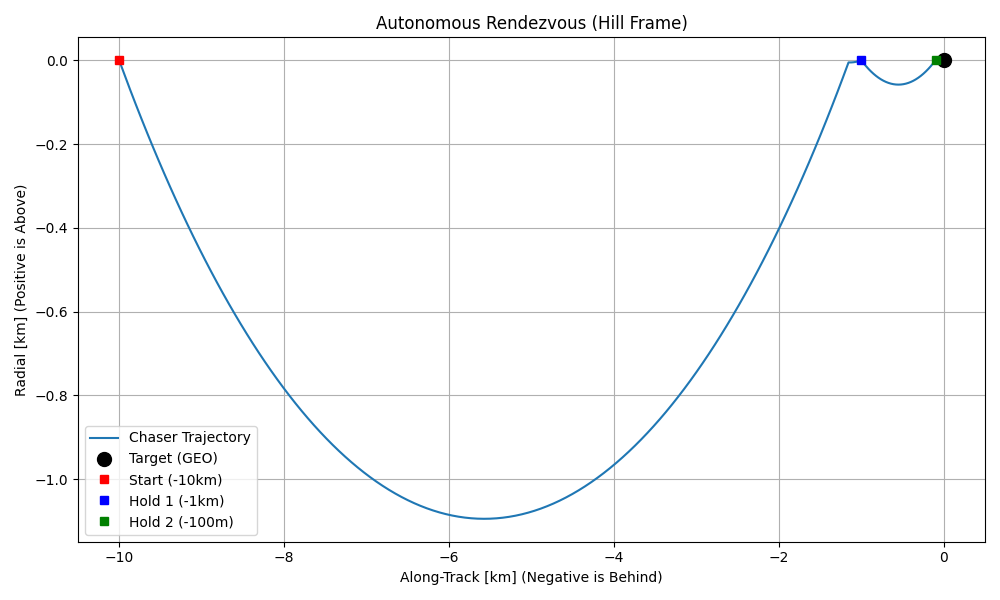
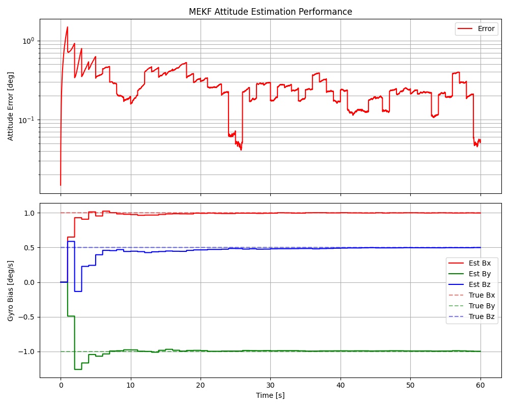
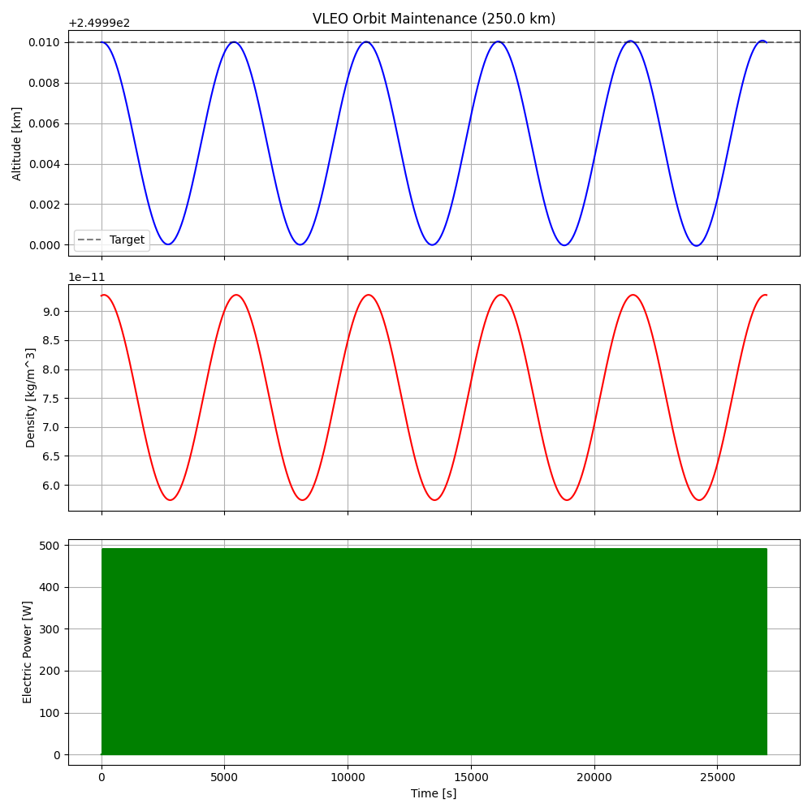
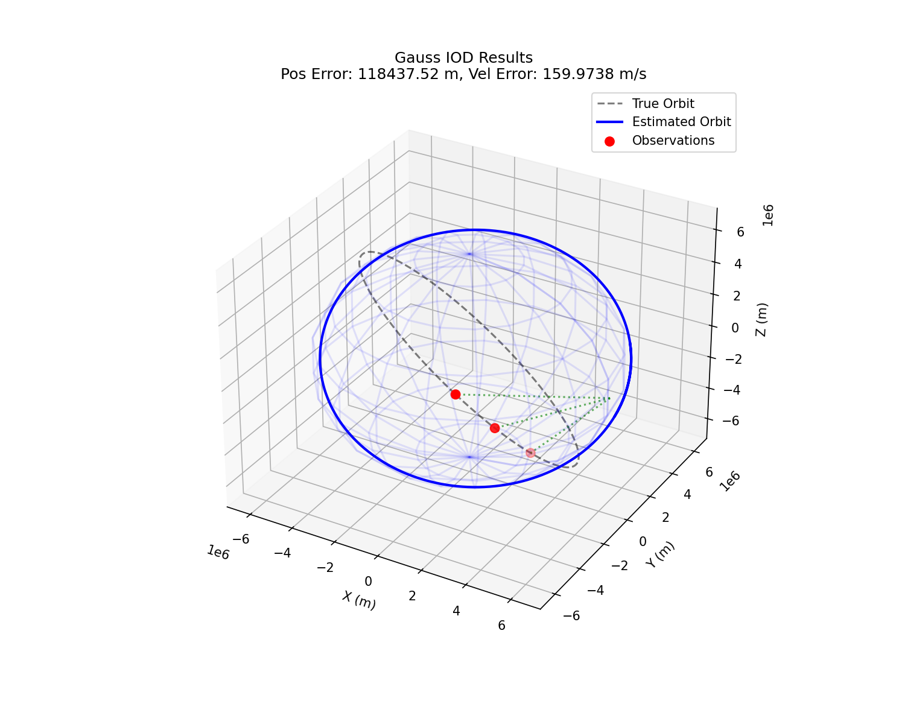
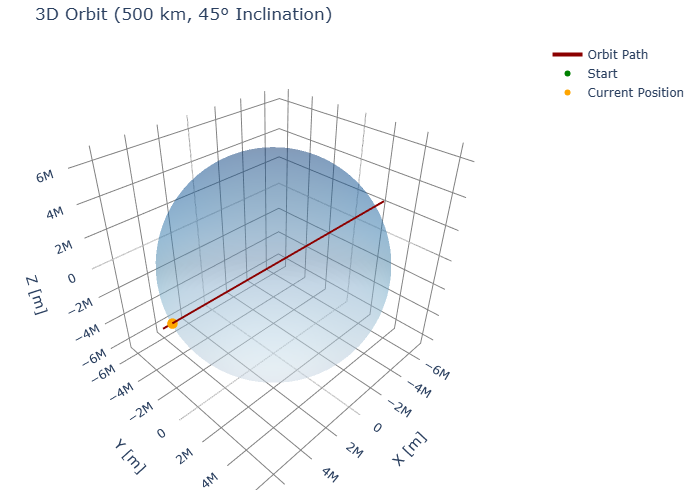

# OpenGNC

[](https://pypi.org/project/OpenGNC/)
[](https://opensource.org/licenses/MIT)
[](https://www.python.org/downloads/)
[](https://github.com/astral-sh/ruff)

**OpenGNC** is a professional-grade, high-fidelity Guidance, Navigation, and Control (GNC) library for spacecraft simulation, orbital mechanics, and mission analysis. Built with SI units and aerospace standards, it provides a comprehensive suite of tools for satellite engineers and researchers.

**[Explore the Documentation](https://BatuhanAkkova.github.io/OpenGNC/)** | **[View Examples](examples/)** | **[Contributing](CONTRIBUTING.md)**

---

## Key Highlights

- **SI Unit Compliance**: All calculations strictly use SI units (meters, kilograms, seconds, radians) unless otherwise explicitly suffixed.
- **High-Fidelity Environment**: Integrated models for NRLMSISE-00 density, IGRF-13 magnetic fields, and EGM2008 gravity harmonics.
- **Validated Algorithms**: Implementations of industry-standard filters (MEKF, UKF) and deterministic methods (QUEST, TRIAD).
- **Optimization Ready**: Built-in support for Optimal Control (LQR) and Model Predictive Control (MPC) using CasADi.
- **Modular Architecture**: Easily swap integrators, disturbance models, or sensors for customized simulations.

---

## Extensive Features

### Environment & Space Weather
- **Atmospheric Models**: NRLMSISE-00 (high-fidelity), Harris-Priester (diurnal bulge), and Exponential density.
- **Geomagnetic Models**: IGRF-13 (International Geomagnetic Reference Field) and Tilted Dipole models.
- **Solar & Ephemeris**: Analytical solar position, shadow models (Umbra/Penumbra), and Planetary ephemeris.
- **Gravity Field**: Recursive EGM2008 Spherical Harmonics (up to N-degree), J2, and Two-body attraction.

### Orbital Mechanics & Propagators
- **Propagators**: Cowell’s Method, Keplerian elements, and SGP4 for TLE propagation.
- **Numerical Integrators**: High-order fixed and adaptive steps: RK4, RK45 (Runge-Kutta-Fehlberg), and DOP853.
- **Orbital Maneuvers**: Hohmann transfer, Bi-elliptic, Phasing, Plane changes, and Lambert Targeting.
- **Initial Orbit Determination (IOD)**: Robust Gauss, Laplace, and universal variable methods.

### Attitude Dynamics & Determination
- **Kinematics**: Quaternion, Euler Angle, and DCM (Direction Cosine Matrix) transformations.
- **Dynamics**: Euler's equations for rigid body rotation, including variable inertia and disturbances.
- **Determination**: Deterministic TRIAD and QUEST algortihms for attitude from vector observations.

### Guidance, Navigation & Control (GNC)
- **State Estimation**: 
  - **MEKF**: Multiplicative Extended Kalman Filter for attitude.
  - **UKF**: Unscented Kalman Filter for non-linear state estimation.
  - **EKF/KF**: Standard and Extended Kalman Filters for orbital state mapping.
- **Control Law Design**:
  - **Classic**: PID controllers and B-Dot detumbling logic.
  - **Optimal**: LQR (Linear Quadratic Regulator) and LQE (Kalman Filter design).
  - **Advanced**: Nonlinear MPC (Model Predictive Control) and Sliding Mode Control.
- **Sensors**: Realistic Star Tracker, Sun Sensor, Magnetometer, and Gyroscope models with bias/noise.
- **Actuators**: Model Reaction Wheels (saturation/jitter) and Thrusters (Chemical/Electric).

### FDIR & Mission Design
- **FDIR (Fault Detection)**: Parity Space methods, Residual Generation, and Safe Mode logic.
- **SSA (Space Situational Awareness)**: Conjunction Assessment (CAT), Maneuver Detection, and TLE interface.
- **Mission Design**: $\Delta v$ Budgeting, Communication Link Budgets, and Ground Station Coverage tools.
- **EDL (Entry, Descent, Landing)**: Ballistic & Lifting entry dynamics, heating models, and Aerocapture guidance.
- **Ground Segment**: CCSDS packet formatting, decommutation, and telemetry data-link layers.

### Visualization & Analysis
- **3D Trajectories**: Interactive Plotly-based orbital trajectory and attitude visualization.
- **Telemetry Dashboards**: Web-based GNC dashboards using Dash for real-time like simulation monitoring.
- **Coordinate Frames**: Visualizers for ECI, ECEF, Hill (RSW), and Body frame transformations.

### Real-Time Performance & Determinism
- **Static Allocation**: Core Kalman Filters (MEKF, UKF) are implemented in header-only C++17/20 with strict static memory allocation (no `malloc`/`new` in hot paths).
- **SIMD Acceleration**: Full Eigen integration for vectorized matrix operations on ARM and x86 architectures.
- **Lock-Free Communication**: High-speed, wait-free **SPSC (Single-Producer Single-Consumer) Queue** for telemetry and command dispatching.

### Mission Verification Suite
- **Monte Carlo Harness**: Scale simulations to 10,000+ runs with parallel processor execution.
- **Statistical Analyzer**: Built-in tools for **3-Sigma margin proofs**, convergence rates, and stability limits.
- **Consistency Verification**: Automated **NIS (Normalized Innovation Squared)** and **NEES** tests to validate filter optimality against stochastic truth.

---

## Installation

### From PyPI (Recommended)
```bash
pip install opengnc
```

#### With MPC support (Optional)
```bash
pip install "opengnc[mpc]"
```

### From Source (Development)
```bash
git clone https://github.com/BatuhanAkkova/opengnc.git
cd opengnc
pip install -e ".[dev]"
```

---

## Quick Start

```python
import numpy as np
from opengnc.environment.mag_field import igrf_field
from opengnc.kalman_filters.mekf import MEKF
from opengnc.utils.quat_utils import quat_rot

# Get Earth's magnetic field at a specific ECI position
B_vec = igrf_field(pos_eci=np.array([7000e3, 0, 0]), time="2024-01-01")

# Initialize a Multiplicative Extended Kalman Filter
mekf = MEKF(q_init=np.array([0, 0, 0, 1]), covariance=1e-3 * np.eye(6))
```

---

## Example Simulations

| Application | Description | Visualization | Script |
| :--- | :--- | :--- | :--- |
| **CubeSat Detumbling** | B-Dot magnetic control using noisy magnetometer data. |  | [01_cubesat_detumbling.py](examples/01_cubesat_detumbling.py) |
| **MPC Rendezvous** | Optimal multi-burn approach in GEO using NMPC. |  | [04_autonomous_rendezvous.py](examples/04_autonomous_rendezvous.py) |
| **MEKF Estimation** | High-fidelity orientation tracking fusing star tracker & gyro. |  | [05_attitude_estimation_mekf.py](examples/05_attitude_estimation_mekf.py) |
| **VLEO Maintenance** | Altitude keeping in high-drag orbits using electric propulsion. |  | [02_vleo_orbit_maintenance.py](examples/02_vleo_orbit_maintenance.py) |
| **Gauss IOD** | Initial Orbit Determination from 3-LoS vectors. |  | [10_gauss_iod_determination.py](examples/10_gauss_iod_determination.py) |
| **Viz & Plots** | Comprehensive orbital and attitude visualization demo. |  | [11_visualization_demo.py](examples/11_visualization_demo.py) |
| **Mission Sim** | Core demonstration of the simulation and logging framework. | - | [example_simulation.py](examples/example_simulation.py) |

---

## License

Distributed under the **MIT License**. See `LICENSE` for more information.

## Contributing & Support

Contributions are welcome! Please see [CONTRIBUTING.md](CONTRIBUTING.md) for guidelines. 
For support or feedback, please contact [Batuhan Akkova](mailto:batuhanakkova1@gmail.com).


